<html>

<head>

</head>

<body lang=DE link="#0563C1" vlink="#954F72">

European Union –
Version 1.5.0

&nbsp;

Contents

<a href="#_Toc51276311">Chapter 1 - The
European Union. 2</a>

<a href="#_Toc51276312">Chapter 1.1 - The
European Union in Millennium Dawn. 2</a>

<a href="#_Toc51276313">Chapter 1.2 -
Institutions of the European Union. 2</a>

<a href="#_Toc51276314">Chapter 1.3 - EU
institutions in Millennium Dawn. 3</a>

<a href="#_Toc51276315">Chapter 1.4 -
Council, Huh?. 3</a>

<a href="#_Toc51276316">Chapter 2 - The EU
Focus Tree. 3</a>

<a href="#_Toc51276317">Chapter 2.1 - The
Voting Tree. 4</a>

<a href="#_Toc51276318">Chapter 2.2 - The
Withdrawal Tree. 4</a>

<a href="#_Toc51276319">Chapter 2.3 - The
United States of Europe Tree & the POTEF Tree. 4</a>

<a href="#_Toc51276320">Chapter 2.4 - The
Member State Focuses. 5</a>

<a href="#_Toc51276321">Chapter 3 - The EU
Voting and Legislation. 5</a>

<a href="#_Toc51276322">Chapter 3.1 - The
European Parliament 5</a>

<a href="#_Toc51276323">Chapter 3.2 -
Legislation in the European Parliament 6</a>

<a href="#_Toc51276324">Chapter 3.3 -
European Council / Council of the European Union. 8</a>

<a href="#_Toc51276325">Chapter 3.4 -
Legislation in European Council / Council of the European Union. 9</a>

<a href="#_Toc51276326">Chapter 3.5 - The AI
Voting. 10</a>

<a href="#_Toc51276327">Chapter 3.6 -
Majority Types. 10</a>

<a href="#_Toc51276328">Chapter 3.7 –
Empowered EP / Overrule the Council 10</a>

<a href="#_Toc51276329">Chapter 3.8 - The EU
Laws and Ideas. 11</a>

<a href="#_Toc51276330">Chapter 4 - The
values of the EU.. 11</a>

<a href="#_Toc51276331">Chapter 4.1 – The
system of EU values. 11</a>

<a href="#_Toc51276332">Chapter 4.2 – Breach
of EU values. 12</a>

<a href="#_Toc51276333">Chapter 5 - The EU
Offices. 13</a>

<a href="#_Toc51276334">Chapter 5.1 -
Political and Financial Offices. 13</a>

<a href="#_Toc51276335">Chapter 5.2 -
Security and International Offices. 14</a>

<a href="#_Toc51276336">Chapter 5.3 -
President of the European Federation. 14</a>

<a href="#_Toc51276337">Chapter 6 -
Euroscepticism.. 14</a>

<a href="#_Toc51276338">Chapter 6.1 - State
of the Union. 15</a>

<a href="#_Toc51276339">Chapter 6.2 -
Euroscepticism Change. 15</a>

<a href="#_Toc51276340">Chapter 6.3 -
Euroscepticism and EU Exit 16</a>

<a href="#_Toc51276341">Chapter 7 - Leaving
the EU.. 16</a>

<a href="#_Toc51276342">Chapter 7.1 - Leaving
the EU by Article 50. 16</a>

<a href="#_Toc51276343">Chapter 7.2 - Leaving
the EU by Accident 16</a>

<a href="#_Toc51276344">Chapter 7.3 - Leaving
the EU by the AI 16</a>

<a href="#_Toc51276345">Chapter 8 - Enlargement
and Joining the EU.. 16</a>

<a href="#_Toc51276346">Chapter 8.1 -
Enlargement of the EU.. 16</a>

<a href="#_Toc51276347">Chapter 8.2 - Joining
the EU.. 17</a>

<a href="#_Toc51276348">Chapter 8.3 - Joining
the Euro. 17</a>

<a href="#_Toc51276349">Chapter 9 - EU
Elections. 17</a>

<a href="#_Toc51276350">Chapter 10 - EU
Budget 18</a>

<a href="#_Toc51276351">Chapter 10.1 -
Multiannual Financial Framework. 18</a>

<a href="#_Toc51276352">Chapter 10.2 - Budget
of the next fiscal year. 20</a>

<a href="#_Toc51276353">Chapter 10.3 - Bill
from Brussels. 21</a>

<a href="#_Toc51276354">Chapter 11 - Uniting
the EU.. 21</a>

<a href="#_Toc51276355">Chapter 11.1 - The
United States of Europe. 21</a>

<a href="#_Toc51276356">Chapter 11.2 - The
European Federation. 22</a>

<a href="#_Toc51276357">Chapter 11.3 - A
Europe of Fatherlands. 22</a>

<a href="#_Toc51276358">Chapter 12 - EU AI 22</a>

<a href="#_Toc51276359">Chapter 12.1 - The EU
focus AI 22</a>

<a href="#_Toc51276360">Chapter 12.2 - The EU
voting strategy AI 22</a>

<a href="#_Toc51276361">Chapter 12.3 - The EU
propaganda AI 22</a>

<a href="#_Toc51276362">Chapter 13 - Hints
and Cheats. 22</a>

<a href="#_Toc51276363">Chapter 13.1 - Hints. 22</a>

<a href="#_Toc51276364">Chapter 13.2 - Voting
Cheat 23</a>

<a href="#_Toc51276365">Chapter 13.3 -
Console Commands. 23</a>

&nbsp;

&nbsp;

<h1><a name="_Toc51276311">Chapter 1 - The European Union</a></h1>

The European Union is a unique economic and
political union between its member states.

The EU is similar to a confederation, where
many policy areas are federalised into common institutions capable of making
law; however, the member states are sovereign nations but they have limited
their sovereignty and transfered some of their powers to the supranational
union.

What began as a purely economic union has
evolved into an organization spanning policy areas, from climate, environment
and health to external relations and security, justice and migration. A name
change from the European Economic Community (EEC) to the European Union (EU) in
1993 reflected this.

<h2><a name="_Toc51276312">Chapter 1.1 - The European Union in
Millennium Dawn</a></h2>

In Millennium Dawn the European Union is
not a playable nation (there is an EUU tag for some coding reasons, but this is
not a regular Hearts of Iron country). In the mod the EU is represented and
played by the member states. Later in the game the player has the possibility
to unite (annex) the member states under one cosmetic tag. Two main factors
that drive the EU are the influence on the other member states and the
Euroscepticism. Besides that, the EU is controlled via the EU Focus Tree and
Decisions.

<h2><a name="_Toc51276313">Chapter 1.2 - Institutions of the
European Union</a></h2>

The EU has six main institutions

·&nbsp;&nbsp;&nbsp;&nbsp;&nbsp;&nbsp;&nbsp;&nbsp;
the European Parliament (EP)

·&nbsp;&nbsp;&nbsp;&nbsp;&nbsp;&nbsp;&nbsp;&nbsp;
the European Council

·&nbsp;&nbsp;&nbsp;&nbsp;&nbsp;&nbsp;&nbsp;&nbsp;
the Council of the European Union

·&nbsp;&nbsp;&nbsp;&nbsp;&nbsp;&nbsp;&nbsp;&nbsp;
the European Commission

·&nbsp;&nbsp;&nbsp;&nbsp;&nbsp;&nbsp;&nbsp;&nbsp;
the Court of Justice of the European Union
(CJEU)

·&nbsp;&nbsp;&nbsp;&nbsp;&nbsp;&nbsp;&nbsp;&nbsp;
the European Central Bank (ECB)

In the EU's unique institutional set-up:

·&nbsp;&nbsp;&nbsp;&nbsp;&nbsp;&nbsp;&nbsp;&nbsp;
the EU's broad priorities are set by the
European Council, which brings together national and EU-level leaders

·&nbsp;&nbsp;&nbsp;&nbsp;&nbsp;&nbsp;&nbsp;&nbsp;
directly elected MEPs represent European
citizens in the European Parliament

·&nbsp;&nbsp;&nbsp;&nbsp;&nbsp;&nbsp;&nbsp;&nbsp;
the interests of the EU as a whole are promoted
by the European Commission, whose members are appointed by national governments
and

·&nbsp;&nbsp;&nbsp;&nbsp;&nbsp;&nbsp;&nbsp;&nbsp;
governments defend their own country's national
interests in the Council of the European Union.

<h2><a name="_Toc51276314">Chapter 1.3 - EU institutions in
Millennium Dawn</a></h2>

In Millennium Dawn the following EU
institutions are implemented:

·&nbsp;&nbsp;&nbsp;&nbsp;&nbsp;&nbsp;&nbsp;&nbsp;
the European Council

·&nbsp;&nbsp;&nbsp;&nbsp;&nbsp;&nbsp;&nbsp;&nbsp;
the Council of the European Union

·&nbsp;&nbsp;&nbsp;&nbsp;&nbsp;&nbsp;&nbsp;&nbsp;
the European Parliament

·&nbsp;&nbsp;&nbsp;&nbsp;&nbsp;&nbsp;&nbsp;&nbsp;
the European Commission

·&nbsp;&nbsp;&nbsp;&nbsp;&nbsp;&nbsp;&nbsp;&nbsp;
the European Central Bank (ECB)

while the other one is not implemented:

·&nbsp;&nbsp;&nbsp;&nbsp;&nbsp;&nbsp;&nbsp;&nbsp;
the Court of Justice of the European Union
(CJEU)

<h2><a name="_Toc51276315">Chapter 1.4 - Council, Huh?</a></h2>

In European politics there are known three institutions
with the name Council: the Council of Europe, the European Council and the
Council of the European Union.

The Council of Europe is an international
organisation whose stated aim is to uphold human rights, democracy and the rule
of law in Europe. The best known body of the Council of Europe is the European
Court of Human Rights, which enforces the European Convention on Human Rights. It's
not an institution of the European Union and therefore it's not in the mod.

The European Council is a collective body
that defines the European Union's overall political direction and priorities.
It comprises the heads of state or government of the EU member states, along
with the President of the European Council and the President of the European
Commission. While the European Council has no legislative power, it is a
strategic (and crisis-solving) body that provides the union with general
political directions and priorities, and acts as a collective presidency.

The Council of the European Union (in the
treaties simply the Council) is one of two legislative bodies together with the
European Parliament. The Council represents the executive governments of the
EU's member states and has a between the member states rotating Presidency.

In Millennium Dawn the European Council and
the Council of the European Union are combined and represented by the voting of
the member states. The President of the European Council is a claimable office
in the mod, while the rotating Presidency of the Council of the European Union
is not implemented at the moment.

<h1><a name="_Toc51276316">Chapter 2 - The EU Focus Tree</a></h1>

The EU Focus Tree is other than any other
Focus Tree in the game. The EU Focus Tree is a shared focus tree and does not
only belong to a single country, but to all (49 potential) member states. Every
EU member state has the shared EU Focus Tree, but these trees are connected.
Only one member state can complete a shared voting focus at the same time. If a
focus for one country is completed it is bypassed for every other member state.
There is one exceptions to this: the Withdrawal Policies branch.

<h2><a name="_Toc51276317">Chapter 2.1 - The Voting Tree</a></h2>

The Voting Tree consists of all other
branches than the Withdrawal Policies branch and the United States of Europe
branch. The focuses of the Voting Tree apply their effect not simply through
completing the focus, they need to be accepted by the voting of the member
states in the Council and the European Parliament. The only effects that are
directly applied are the Euroscepticism bonuses and malus. Some of the branch
header have no (other) effect and need no voting. As the focuses need to be
accepted by the voting of the member states, there are no mutually exclusive
focuses. But some focuses are mutually exclusive in the result. If one is
accepted the other can't be completed. See the tooltip for details.

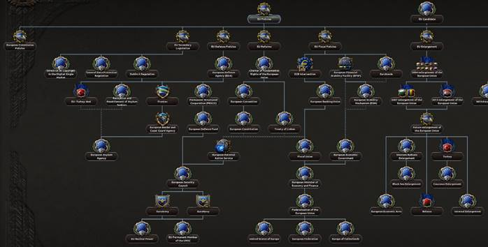

<h2><a name="_Toc51276318">Chapter 2.2 - The Withdrawal Tree</a></h2>

The Withdrawal Policies branch is like a
normal focus tree. The focuses there are not linked to focuses of other member
states and there is no voting on the exit focuses.

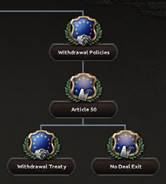

<h2><a name="_Toc51276319">Chapter 2.3 - The
United States of Europe Tree & the POTEF Tree</a></h2>

The United States of Europe Tree is similar to a normal shared focus tree. Only the country that unifies the United States of Europe can access the United States of Europe Tree.

The President of the European Federation (POTEF) Tree is a shared tree which can only be completed by the current POTEF. Once a POTEF completes a focus it is bypassed for all other member states. The POTEF tree is headed by regional doctrine focuses which are available if one of the regional group is a member state. If the POTEF itself is one of that group, the bonus effect is applied on competition of the focus. E.g. the Alpine Doctrine is only available if either Swiss or Austria is a member state. If France completes it, the player only gets the basic effect, but if the player completes it as Austria he also gets the bonus effect. Basic and Bonus effect can be seen in the tooltips.

<h2><a name="_Toc51276320">Chapter 2.4 - The Member State
Focuses</a></h2>

The Member State Focuses is unique for
every member state. Regularly there is no voting on these focuses. The Member
State Focuses reflect how the national policies of a member state could
influence the policies of the whole Union. The Member State Focuses are located
and integrated in the national tree of the specific member state.

<h1><a name="_Toc51276321">Chapter 3 - The EU Voting and
Legislation</a></h1>

After an EU Voting focus is completed, the
country completing it gets two decisions. One to put that proposal on the
agenda of the European Parliament and another one to put it to the vote in the
EU Council after it was approved by the European Parliament.

<h2><a name="_Toc51276322">Chapter 3.1 - The European
Parliament</a></h2>

The European Parliament is the first legislative
body of the EU in Millennium Dawn. It consists of political groups and independent
MEPs. They represent the party system of Millennium Dawn. Each subideology of
Millennium Dawn is either a political group or just independent MEPs (if they
got enough vote in the European elections in their own member state).

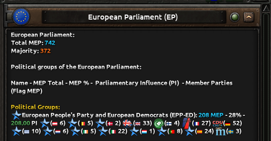

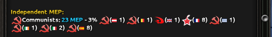

The player can change the view to just see
the political group and independent MEPs, but not their members from the
different member states.

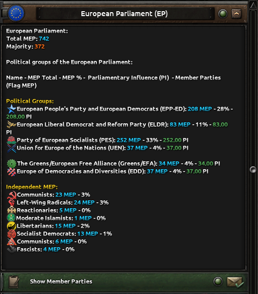

At the moment only the political group have
an gameplay effect in the legislative procedure of the EP. There are two
important stats in the EP, the number of MEPs (cyan) and the Parliamentary
Influence (green). The number of MEPs is just the sum of the MEPs who get
elected to the EP for that subideology. Parliamentary Influence (PI) is a
number to represent the political bargaining in the EP.

<h2><a name="_Toc51276323">Chapter 3.2 - Legislation in the
European Parliament</a></h2>

The first decision of the legislative
procedure is the decision to put the issue on the agenda of the European
Parliament. 

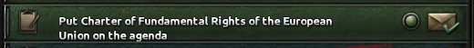

When the issue is put on the agenda the
approve mission becomes availible.

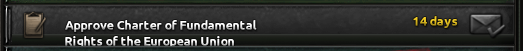

The player has 14 days to complete that
mission by gathering the support of the majority of the MEPs.

The political group which the government of
the acting country belongs to, will immediately support that issue. For all
other political groups an influence decision becomes available, to get them to
support the issue.

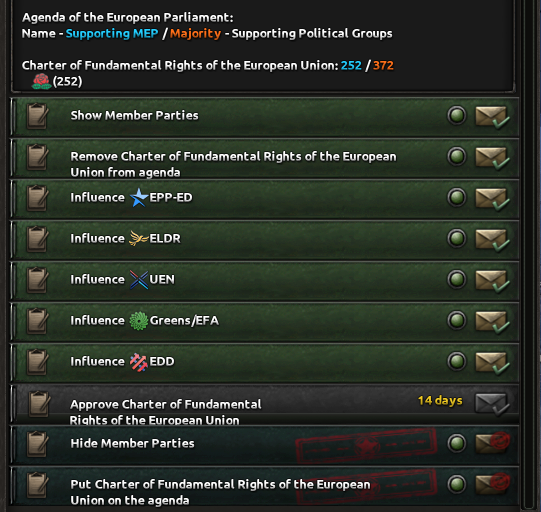

If one of them is take a decision becomes
available according to the political position of the own government and the
targeted political group.

If the political group likes the issue more,
a 'offer support' decision becomes available. 

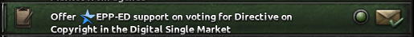

The 'offer support' decision will give the
player PP and lower the PI of the group according to the number of MEPs of the
group, because they like the issue more than the ruling party of the player.

If the political group has the same desire
for that issue a 'suggest...together' decision becomes available.

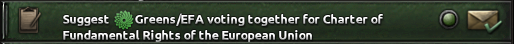

The 'suggest...together' decision is free
for both, because both like the issue in the same way. So no PP is gained or
lost and the PI stays the same.

Finally, if the political group dislikes
the issue more a 'convince' decision becomes available. 

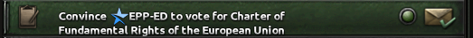

The 'convince' decision will cost the
player PP and give the political group PI according to the number of MEPs of
the group. To get their support for something they don't like the play has to
promise them support for one of their issues in the future and that is
represented by the rising PI.

If the player has taken the decisions for
one political group, he has to wait one day till the next one can be influenced.
Otherwise the second decision is not updated to the new political group.

The desire of a political group for a
certain issue is identically to the government resist factor of the focus
(which can be seen in the focus tree tooltip).

When the player has gathered enough MEP
support for a majority, he can complete the mission and get EP approval for
that issue. Than the legislative procedure is continued in the Council.

<h2><a name="_Toc51276324">Chapter 3.3 - European Council /
Council of the European Union</a></h2>

The European Council / Council of the
European Union (hereinafter the Council) is the second legislative body of the
EU in Millennium Dawn. The Council represents the member states in the legislative
procedure. Further all legal acts of the EU are listed here with their majority
type and current status. Draft means the focus was completed and the issue is
ready to be put on the agenda of the EP. EP Approval means the issue has been
approved by the EP and is ready for the voting in the Council. Accepted means
the Council has accepted the issue and it is enacted. Dismissed means the
Council has dismissed the issue and it's not ready for retry yet.

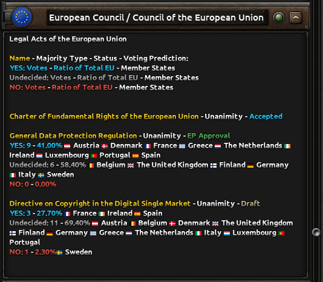

There is also a Voting Prediction there.
The prediction shows how the member states would vote, when there would be a
voting at this moment. The prediction is automatically updated every week, but
there is also a decision to update it manually. If the prediction shows YES or
NO the AI will definitely vote in that way. If it shows undecided the chance
for a AI voting YES:NO are in a raged of 65:35 to 35:65.

Besides the update decision, there is also
the decision to activate the EU Voting Cheat and an option to disable the AI
voting retry, when a issue was dismissed in the Council screen.

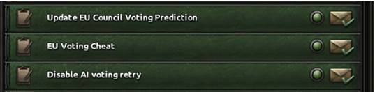

&nbsp;

<h2><a name="_Toc51276325">Chapter 3.4 - Legislation in European
Council / Council of the European Union</a></h2>

When the issue was approved by the EP and
the player meets the influence or office requirements the voting decision
becomes available.

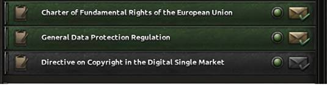

When the voting decision is taken in the
Council each member state gets a voting event and the voting result mission is
activated.

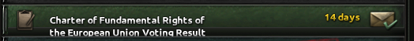

The voting result mission can be taken,
when all member states have voted on the issue and pops up the voting result
event.

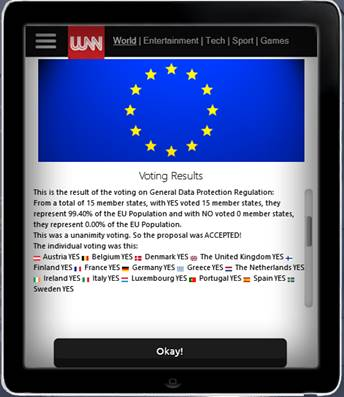

When the proposal is accepted the effect of
the focus is applied and the legislative procedure is finished. When the
proposal is dismissed the retry process is started.

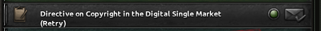

For 30 days the retry decision is blocked,
but after that timespan every member state can take the retry decision and
start the legislative procedure again.

<h2><a name="_Toc51276326">Chapter 3.5 - The AI Voting</a></h2>

The voting behaviour of the AI is
determined by three factors: the influence of the proposing country (5%, 10%,
20%, 30%, 50%), the Euroscepticism of the voting country (10%, 20%, 30%, 50%,
70%) and the government resist factor of the voting country. The government
resist factor reflects the attitude of the political parties towards the
subject of the voting. There are four stances: strongly resist, resist, support
and strongly support (you can see the government resist factor in the Focus Tree
at the focus effect tooltip).

<h2><a name="_Toc51276327">Chapter 3.6 - Majority Types</a></h2>

There are two majority types for the voting
in the Council: Unanimity and Qualified Majority Voting (QMV). While in the EP
the regular majority type is a simple majority.

Unanimity voting needs every member state
to vote for the proposal. Therefore, every member state has the right of veto.

In the case of Qualified Majority Voting
(QMV) there are two majorities that have to be met: 55% of the member states
who represent 65% of the Population of the EU have to vote for the proposal to
be accepted. Therefore, member states who together represent 35% of the
Population of the EU have a blocking minority.

<h2><a name="_Toc51276328">Chapter 3.7 – Empowered EP / Overrule
the Council</a></h2>

With the European Constitution or the
European Federation, the EP is empowered to overrule the Council on issues the
Council dismissed. If these prerequisites are met the Overrule decision becomes
available, when the retry decision is taken and the issue is put on the agenda
of the EP again.

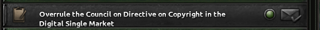

The EP can overrule the Council and
directly enact an issue, with a supermajority of two third of the MEPs.

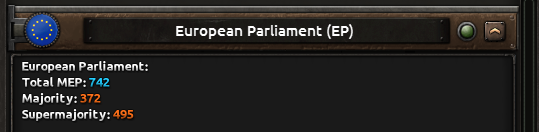

<h2><a name="_Toc51276329">Chapter 3.8 - The EU Laws and Ideas</a></h2>

An important part of the focus effects are
national spirits. They represent the legislation of the European Union.

There are two kinds of national spirits for
EU member states. The first one are crisis or negative circumstances that are
applied by events or from the start. The effect of some of the focuses are to
remove or prevent these negative national spirits when the voting is accepted.
The other one apply bonuses to the member states. They are added when the
proposal is accepted by the voting of the member states.

If a new member state joins the EU, this
county doesn't get all national spirits by default. It has to adopt the EU law
through a decision.

Leaving the EU means losing all EU national
spirits. In addition to that the leaving country gets a timed national spirits
according to the exit route the country takes.

<h1><a name="_Toc51276330">Chapter 4 - The values of the EU</a></h1>

<i>&quot;The Union is founded on the values
of respect for human dignity, freedom, democracy, equality, the rule of law and
respect for human rights, including the rights of persons belonging to
minorities. These values are common to the Member States in a society in which
pluralism, non-discrimination, tolerance, justice, solidarity and equality
between women and men prevail.&quot;</i> 
Article 2, Treaty on European Union

<h2><a name="_Toc51276331">Chapter 4.1 – The system of EU
values</a></h2>

In Millennium Dawn the system of EU values
is featured by different game concepts. If one of these triggers is met, the
breach of EU values variable is set to the respective level. It's checked every
day. The following values are implemented:

EU value:

issue of breach - level of breach

Rule of Law:

·&nbsp;&nbsp;&nbsp;&nbsp;&nbsp;&nbsp;&nbsp;&nbsp;
Paralyzing Corruption - 5

·&nbsp;&nbsp;&nbsp;&nbsp;&nbsp;&nbsp;&nbsp;&nbsp;
Crippling Corruption - 4

·&nbsp;&nbsp;&nbsp;&nbsp;&nbsp;&nbsp;&nbsp;&nbsp;
Rampant Corruption - 3

·&nbsp;&nbsp;&nbsp;&nbsp;&nbsp;&nbsp;&nbsp;&nbsp;
Unrestrained Corruption - 2

·&nbsp;&nbsp;&nbsp;&nbsp;&nbsp;&nbsp;&nbsp;&nbsp;
Systematic Corruption - 1

Respect for human dignity and freedom:

·&nbsp;&nbsp;&nbsp;&nbsp;&nbsp;&nbsp;&nbsp;&nbsp;
has offensive war with EU member state - 10

·&nbsp;&nbsp;&nbsp;&nbsp;&nbsp;&nbsp;&nbsp;&nbsp;
has communist government - 2

·&nbsp;&nbsp;&nbsp;&nbsp;&nbsp;&nbsp;&nbsp;&nbsp;
has reactionary government - 2

·&nbsp;&nbsp;&nbsp;&nbsp;&nbsp;&nbsp;&nbsp;&nbsp;
has communist in coalition - 1

·&nbsp;&nbsp;&nbsp;&nbsp;&nbsp;&nbsp;&nbsp;&nbsp;
has reactionary in coalition - 1

Democracy:

·&nbsp;&nbsp;&nbsp;&nbsp;&nbsp;&nbsp;&nbsp;&nbsp;
No elections - 5

·&nbsp;&nbsp;&nbsp;&nbsp;&nbsp;&nbsp;&nbsp;&nbsp;
Dictatorship - 5

·&nbsp;&nbsp;&nbsp;&nbsp;&nbsp;&nbsp;&nbsp;&nbsp;
Communist Dictatorship - 5

·&nbsp;&nbsp;&nbsp;&nbsp;&nbsp;&nbsp;&nbsp;&nbsp;
Fascist Dictatorship - 5

·&nbsp;&nbsp;&nbsp;&nbsp;&nbsp;&nbsp;&nbsp;&nbsp;
is puppet - 4

·&nbsp;&nbsp;&nbsp;&nbsp;&nbsp;&nbsp;&nbsp;&nbsp;
Neo-Imperialism - 1

Women and Minority Rights:

·&nbsp;&nbsp;&nbsp;&nbsp;&nbsp;&nbsp;&nbsp;&nbsp;
Prohibited Service for Women - 1

·&nbsp;&nbsp;&nbsp;&nbsp;&nbsp;&nbsp;&nbsp;&nbsp;
Election Threshold 10% - 1

No Bailout clause:

·&nbsp;&nbsp;&nbsp;&nbsp;&nbsp;&nbsp;&nbsp;&nbsp;
Bankrupcy - 1

·&nbsp;&nbsp;&nbsp;&nbsp;&nbsp;&nbsp;&nbsp;&nbsp;
Bailout given - 1

<h2><a name="_Toc51276332">Chapter 4.2 – Breach of EU values</a></h2>

Due to the system of EU values the national
focus trees of the member states are no longer limited by EU membership for
their radical branches. Instead of that the system of EU values offers the
player a variety of decisions to react on a breach of EU values by a member
state. The level of breach can be seen for each member state in the State of
the European Union screen.

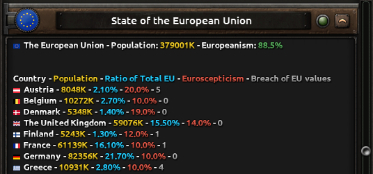

At a level of 4 and above the Council can
determine a serious breach of EU values through that member state.

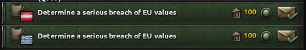

Prerequisite is that the country which
wants it determine is top 3 influencer among all other member states and the
target is not top 3 influencer in any member state.

Determining a serious breach of EU values
will raise the Euroscepticism of the target about 15% and enables further
decisions, while revoking it will lower it about the same amount. Determining a
serious breach of EU values is prerequisite for two other decisions: suspending
the EU Voting Rights and suspending the EU Subsidies.

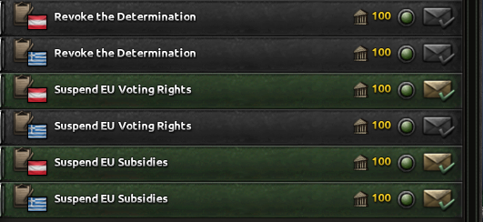

A member state with suspended EU Voting
Rights can't vote anymore in the Council.

A member state with suspended EU Subsidies
doesn't get any more money from the EU, while it still has to pay its contribution.

Both decision can be undone if the targeted
member state reduce its breach of EU value 

<h1><a name="_Toc51276333">Chapter 5 - The EU Offices</a></h1>

In the EU every institution has a head. In
this sense the Offices of the EU in the mod are the personification and the
representation of these institutions. In the tradition of the European Union
these offices are shared among the member states. So it is in Millennium Dawn.
In general, a member state can only hold one office at once. To claim an office
a member state needs at least 5% influence on every other member state or a
population of more than 5% of the Total EU Population. So it is more likely
that the most offices are shared among the big member states.

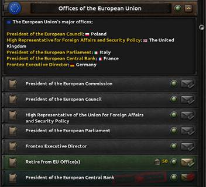

<h2><a name="_Toc51276334">Chapter 5.1 - Political and
Financial Offices</a></h2>

The Political Offices are

·&nbsp;&nbsp;&nbsp;&nbsp;&nbsp;&nbsp;&nbsp;&nbsp;
President of the European Commission,

·&nbsp;&nbsp;&nbsp;&nbsp;&nbsp;&nbsp;&nbsp;&nbsp;
President of the European Council and

·&nbsp;&nbsp;&nbsp;&nbsp;&nbsp;&nbsp;&nbsp;&nbsp;
President of the European Parliament

and the Financial Offices are

·&nbsp;&nbsp;&nbsp;&nbsp;&nbsp;&nbsp;&nbsp;&nbsp;
President of the European Central Bank and

·&nbsp;&nbsp;&nbsp;&nbsp;&nbsp;&nbsp;&nbsp;&nbsp;
European Minister of Economy and Finance.

The Office of the President of the European
Commission, the President of the European Council and the President of the
European Parliament have in common, that they allow to put a focus to the vote
without having 3% influence on any other member state. In addition to that they
rise chances of success in the Pro-European and Euroscepticism Campaigns.

President of the European Central Bank can
start, expand or reduce the OMT Program of the ECB to temporary reduce the
interest rates of member states with high interest rates.

The European Minister of Economy and
Finance can always put a budget draft on the agenda of the EP, while other
member states or offices need a certain level of influence on all other member
states.

<h2><a name="_Toc51276335">Chapter 5.2 - Security and
International Offices</a></h2>

The Security Offices are

·&nbsp;&nbsp;&nbsp;&nbsp;&nbsp;&nbsp;&nbsp;&nbsp;
Frontex Executive Director,

·&nbsp;&nbsp;&nbsp;&nbsp;&nbsp;&nbsp;&nbsp;&nbsp;
Secretary General of EuroArmy and

·&nbsp;&nbsp;&nbsp;&nbsp;&nbsp;&nbsp;&nbsp;&nbsp;
Secretary General of EuroNavy.

The International Offices are

·&nbsp;&nbsp;&nbsp;&nbsp;&nbsp;&nbsp;&nbsp;&nbsp;
High Representative of the Union for Foreign
Affairs and Security Policy and

·&nbsp;&nbsp;&nbsp;&nbsp;&nbsp;&nbsp;&nbsp;&nbsp;
Ambassador of the Union to the United Nations.

The Frontex Executive Director and the
Secretary General of EuroArmy have the power to take control over the respectiv
forces for the time of their tenure.

The Secretary General of EuroNavy can take
control of the warships of every member state and can unite them in one
European fleet.

High Representative of the Union for
Foreign Affairs and Security Policy has no special power at the moment. In
future updates it is planned to give it some diplomatic powers or decisions.

Ambassador of the Union to the United Nations
give its holder nation the Permanent Member of the UNSC national spirit.

<h2><a name="_Toc51276336">Chapter 5.3 - President of the
European Federation</a></h2>

The President of the European Federation is a unique office in the European Union/Federation because the holding member state is the paramount leader of Europe. Therefore, the President of the European Federation can claim every other office for his member states.
This office of the President of the European Federation (POTEF) becomes accessible, when the European Federation is founded (member states have to vote for the focus European Federation). After that every member state can call an election by decision. Once the decision is taken, the POTEF election campaign is activated. The race to POTEF election is started and will last for 90 days. During this time, each political party can declare one of their ruling leaders to nominee for the POTEF elections. To claim the nomination, you have to be top 3 influencer in all member states with the same ruling party. During this period, you can show and hide the POTEF election polls, which will be updated weekly. There are two stats the popular vote and the member states win. The popular vote is the sum of all party popularities in all member states. A member state is won, when the party has a simple majority of party popularity in that member state.

The term of the POTEF depends on the majority he acquires in the election:

·&nbsp;&nbsp;&nbsp;&nbsp;&nbsp;&nbsp;&nbsp;&nbsp;
5-year-term: absolute majority of Popular Vote AND Member State Wins

·&nbsp;&nbsp;&nbsp;&nbsp;&nbsp;&nbsp;&nbsp;&nbsp;
3-year-term: one absolute majority AND one relative majority

·&nbsp;&nbsp;&nbsp;&nbsp;&nbsp;&nbsp;&nbsp;&nbsp;
2-year-term: relative majority of Popular Vote AND Member State Wins

·&nbsp;&nbsp;&nbsp;&nbsp;&nbsp;&nbsp;&nbsp;&nbsp;
1-year-term: relative majority of Popular

During the time of the POTEF election campaign the nominees can run an election campaign in the member states to raise the popularity of their political group in that member state.

<h1><a name="_Toc51276337">Chapter 6 - Euroscepticism</a></h1>

Euroscepticism is one of the basic concepts
for the EU in Millennium Dawn.

Euroscepticism, also known as
EU-scepticism, means criticism of the European Union (EU) and European
integration. According to public opinion surveys this ratio represents the
number of people who will likely vote for leaving the European Union in the
case of a European Union membership referendum of their country.

Europeanism also known as Pro-Europeanism,
sometimes called European Unionism, is a political position that favours
European integration and membership of the European Union (EU). It includes the
more radical European federalists, who seek to create a single superstate known
informally as a United States of Europe. A related term is ’Europhile’. The
ratio represents the Europhile people throughout the whole Union.

Euroscepticism is one of the main variable
driving the EU member states in one direction or the other. Europeanism on the
other hand is just a derivative variable from Euroscepticism. It is used as
trigger to refer to the Union as a whole.

<h2><a name="_Toc51276338">Chapter 6.1 - State of the Union</a></h2>

The State of the Union category is the main
interface for the player to get an overview about the European Union and the
Euroscepticism throughout the Union. While most of the Euroscepticism effects
also update the State of the Union statistic, sometimes it is necessary to
update by hand. Therefor the update decision can be used.

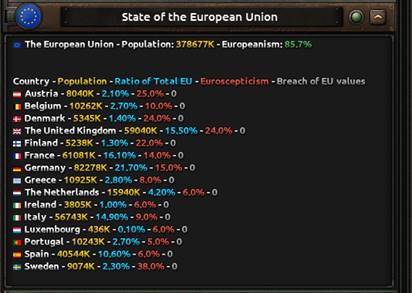

<h2><a name="_Toc51276339">Chapter 6.2 - Euroscepticism Change</a></h2>

One source of Euroscepticism are the
focuses on completition. Most of them add Euroscepticism to all current and
potential member states. Some add a special amount to certain countries. This
reflects the unique national tradition in some policies areas, like financial
discipline in the northern countries or soft currency in the southern member
states.

Another source of Euroscepticism are the
Euroscepticism Campaign Decisions. On the other side of the coin the
Pro-European Campaigns can reduce the Euroscepticism.

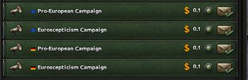

Finally, there are some events and decision,
which can add or reduce the Euroscepticism. E.g. the OMT Program decisions.

<h2><a name="_Toc51276340">Chapter 6.3 - Euroscepticism and EU
Exit</a></h2>

Euroscepticism will drive the AI to EU
Exit. The probability from the Euroscepticism is modified by the ruling party.
Governments with nationalist outlook will always try to leave the Union.
Conservative governments are pro-European in general, but they flip over in the
exit camp, when Euroscepticism rises above 60%. All other major European
parties try to stay in the EU, but somewhere above 70% Euroscepticism they
can't ignore the will of the people.

<h1><a name="_Toc51276341">Chapter 7 - Leaving the EU</a></h1>

Leaving the EU is a longer process which
will not take place over night. Never the less an EU exit can also happen by
accident.

<h2><a name="_Toc51276342">Chapter 7.1 - Leaving the EU by
Article 50</a></h2>

The first step in leaving the EU is to
complete the Article 50 focus. Than the Withdrawal category and the leave
decision becomes available. When selected the leaving mission is activated.
With the mission activated the player has two years to complete the Withdrawal
Treaty focus and select the mission. Otherwise a No Deal Exit will happen.
There is an option to have a prepared No Deal Exit, when the No Deal Exit focus
is complete or to have an unprepared No Deal Exit when none of the two focuses
is completed within the two year.

The player has also the option to revoke
Article 50 and stay in the EU.

If the player needs more time, there is a
decision to extend Article 50.

Note: the extention only set the remaining
time to three months. So if it is activated to early, it is not an extention
but a shortening.

<h2><a name="_Toc51276343">Chapter 7.2 - Leaving the EU by
Accident</a></h2>

In the European Debt Crisis there is a possibility
for a EU exit by accident. This happens if the member state fails to complete
the mission Troika Reforms.

<h2><a name="_Toc51276344">Chapter 7.3 - Leaving the EU by the
AI</a></h2>

As described in Chapter 6.3 the AI will
leave the EU, when certain Euroscepticism levels are reached. The levels depend
on the ruling party.

<h1><a name="_Toc51276345">Chapter 8 - Enlargement and Joining
the EU</a></h1>

<i>&quot;Any European State which respects
the values referred to in Article 2 and is committed to promoting them may
apply to become a member of the Union. The European Parliament and national
Parliaments shall be notified of this application. The applicant State shall
address its application to the Council, which shall act unanimously after
consulting the Commission and after receiving the consent of the European
Parliament, which shall act by a majority of its component members. The
conditions of eligibility agreed upon by the European Council shall be taken
into account. 
The conditions of admission and the adjustments to the Treaties on which the
Union is founded, which such admission entails, shall be the subject of an
agreement between the Member States and the applicant State. This agreement
shall be submitted for ratification by all the contracting States in accordance
with their respective constitutional requirements.&quot; 
</i>Article 49, Treaty on European Union

In Millennium Dawn there are three types of
European countries (in the sense of Article 49): the potential EU countries,
the candidates and the member states. The potential EU countries are a
predefined and scripted scope of countries which could possibly become a member
states of the European Union (this could not be influenced in the game).
Candidates are countries which were selected by the voting of the EU member
states to become members in the future. Finally, there are the member states
who are already member of the EU in the 2000 and 2017 bookmark.

<h2><a name="_Toc51276346">Chapter 8.1 - Enlargement of the EU</a></h2>

The Enlargement of the EU is done by the
Enlargement focuses followed by the voting of the member states. There are the
historical EU Enlargement packages of 2004, 2007 and 2013 and beyond that there
are future Enlargement packages in the focus tree.

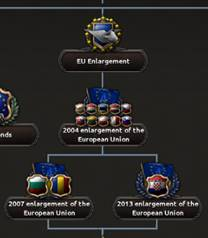

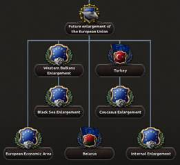

<h2><a name="_Toc51276347">Chapter 8.2 - Joining the EU</a></h2>

When the EU member states have voted for an
Enlargement package the respective countries become a candidate. As candidate
the member state gets a decision to join the European Union. The accession
criteria are that the level of breach of EU values is less than three.

A potential EU country can also get the candidate
status through the EU Candidate focus, but the prerequisites for that are high.

After the joining, the new member state
gets the national spirit European Union Member. To get the other EU national
spirits the member state needs to select the Adopt the EU law decision (see
Chapter 3.8 for details).

<h2><a name="_Toc51276348">Chapter 8.3 - Joining the Euro</a></h2>

After becoming a EU member states, the
country can also join the Euro if certain criteria are met. The country needs
at least a Stable Growth Economic Cycle, a GDP/C of at least 10.000$ and a
Corruption Level of 5 or lesser.

<h1><a name="_Toc51276349">Chapter 9 - EU Elections</a></h1>

EU Elections take place every five years. The
allocation of seats to each member state is based on the principle of
degressive proportionality, so that, while the size of the population of each
country is taken into account, smaller states elect more MEPs than is
proportional to their populations. Every member state gets at least 6 MEPs and
the rest of the 750 MEPs are distributed according to the population of the
member states. Every member state elects the MEPs for its seats according to
the party popularity at the time of the election.

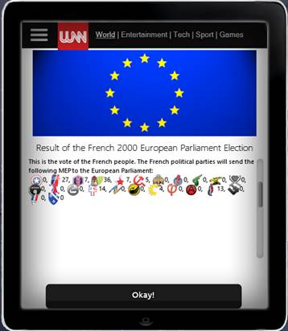

<h1><a name="_Toc51276350">Chapter 10 - EU Budget</a></h1>

The EU Budget consists of two separate
parts the Multiannual Financial Framework and the Budget of the next fiscal
year.

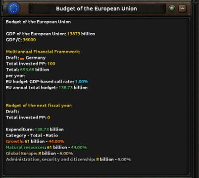

<h2><a name="_Toc51276351">Chapter 10.1 - Multiannual
Financial Framework</a></h2>

The Multiannual Financial Framework is a
long-term spending plan, allowing the EU to plan and invest in long-term
projects.

In Millennium Dawn the Multiannual
Financial Framework defines the contribution of the member states to the EU for
the next five years

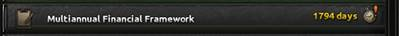

During the Preparation process the member
states negotiate on the draft of the Multiannual Financial Framework. At the
end of the process the draft is accepted or a provisionally (standard)
Multiannual Financial Framework is put into effect.

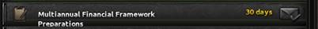

The member state which drafts the Multiannual
Financial Framework has to put the draft on the agenda of the European
Parliament at the end of the negotiations. As reward the drafting member state
get the total invested political power, when the Multiannual Financial
Framework is approved and put into effect.

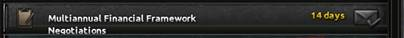

During the Negotiations all member states
can invest political power to change the draft to their conception. Changes to
the draft will influence the view of the political groups of the European
Parliament to the draft. The member states can raise and lower the global call
rate or their own call rate.

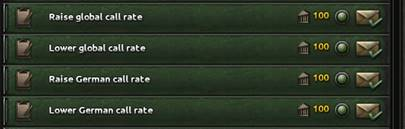

Under certain circumstances (Euroscepticism
&gt; 40% or other call rate than the global call rate) the member states can
also change the call rate of a target country.

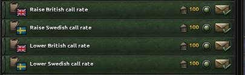

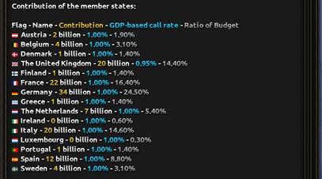

<h2><a name="_Toc51276352">Chapter 10.2 - Budget of the next
fiscal year</a></h2>

The Budget of the next fiscal year is the
money which the EU can spent in that year.

In Millennium Dawn the Budget of the next
fiscal year defines the distribution of the money to the member states to the
EU for the next year

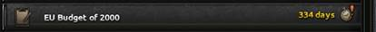

During the Preparation process the member
states negotiate on the draft of the EU Budget for the next fiscal year. At the
end of the process the draft is accepted or a provisionally (standard) EU
Budget is put into effect.

The member state which drafts the EU Budget
of the next fiscal year has to put the draft on the agenda of the European
Parliament at the end of the negotiations. As reward the drafting member state
get the total invested political power, when the EU Budget is approved and put
into effect.

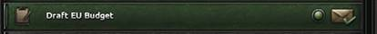

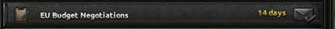

During the Negotiations all member states
can invest political power to change the draft to their conception. Changes to
the draft will influence the view of the political groups of the European
Parliament to the draft.

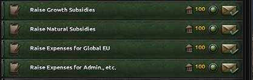

Raising one category will also change the
other one.

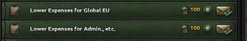

The Growth Subsidies are distributed
according to the economic cycle (the worst, the more) and the population of the
member state. The Natural Subsidies are distributed according to the GDP/C
level (the lower, the more) and the population of the member state. The Global
EU Subsidies are distributed to the Leader of EU Foreign Policy. The
Administration Subsidies are distributed to the President of the European
Commission and/or the Frontex Executive Director.

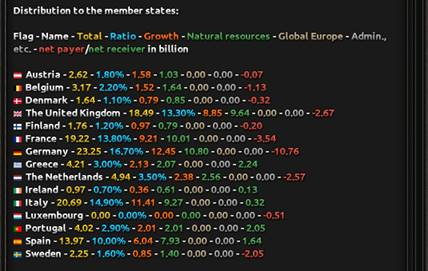

<h2><a name="_Toc51276353">Chapter 10.3 - Bill from Brussels</a></h2>

At the 1st February of every
year each member state gets a Bill from Brussels and the money for that member
state is paid and the contribution is collected.

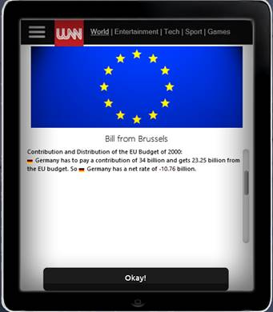

<h1><a name="_Toc51276354">Chapter 11 - Uniting the EU</a></h1>

There are three different ways to bring the
European integration to an end: 

·&nbsp;&nbsp;&nbsp;&nbsp;&nbsp;&nbsp;&nbsp;&nbsp;
The United States of Europe

·&nbsp;&nbsp;&nbsp;&nbsp;&nbsp;&nbsp;&nbsp;&nbsp;
The European Federation

·&nbsp;&nbsp;&nbsp;&nbsp;&nbsp;&nbsp;&nbsp;&nbsp;
A Europe of Fatherlands

<h2><a name="_Toc51276355">Chapter 11.1 - The United States of
Europe</a></h2>

After more than 70 years of European
integration the member states of the European Union are ready to give up their
sovereignty and form the United States of Europe (USoE).
With this unification the USoE focus tree becomes available.

<h2><a name="_Toc51276356">Chapter 11.2 - The European
Federation</a></h2>

The member states of the European Union are
ready to transfer the Union into the European Federation with the Qualified
Majority Voting as fundamental principle and headed by the President of the
European Federation.
With this federalisation the POTEF tree becomes available for the elected POTEF.

<h2><a name="_Toc51276357">Chapter 11.3 - A Europe of
Fatherlands</a></h2>

The Europe of Fatherlands puts an end to
the European integration:

Any further European integration will
jeopardise the cultural heritage, the national identities and the sovereignty
of the member states. Europe is a Europe of Fatherlands, so the European
integration has to stop at this stage.

<h1><a name="_Toc51276358">Chapter 12 - EU AI</a></h1>

For the EU exit AI see Chapter 6.3.

<h2><a name="_Toc51276359">Chapter 12.1 - The EU focus AI</a></h2>

The base factor for the AI to choose EU
focuses are 20, so AI will do this from time to time.

Factors that influence the base factor are
the following:

·&nbsp;&nbsp;&nbsp;&nbsp;&nbsp;&nbsp;&nbsp;&nbsp;
The historical date of the focuses.

·&nbsp;&nbsp;&nbsp;&nbsp;&nbsp;&nbsp;&nbsp;&nbsp;
The AI member state has 5% influence or more on
any other member state.

·&nbsp;&nbsp;&nbsp;&nbsp;&nbsp;&nbsp;&nbsp;&nbsp;
The Euroscepticism level of the AI member state;
the more Euroscepticism, the more likely to avoid further EU focuses.

·&nbsp;&nbsp;&nbsp;&nbsp;&nbsp;&nbsp;&nbsp;&nbsp;
The national bias against certain focuses; this
corresponds to the special Euroscepticism malus the country gets from that
focus.

<h2><a name="_Toc51276360">Chapter 12.2 - The EU voting strategy
AI</a></h2>

At the moment there is no overall EU
influence strategy AI. So the AI can't change the chance to get a proposal
through the voting or even to get the voting decision available. To deal with
that the AI has a special decision to get 3% influence on all member states, if
the AI has completed a voting focus.

<h2><a name="_Toc51276361">Chapter 12.3 - The EU propaganda AI</a></h2>

The Pro-European government with the
following ruling parties will try to keep Euroscepticism low:

Liberals, Libertarians, Social Democrats, Socialist
Democrats, Greens, Communists, Left-Wing Radicalism, Communists

The following government are also
Pro-European as long as Euroscepticism is below 60% Conservatives, Reactionaries,
Conservatives; they will try to keep the Euroscepticism low in these
circumstances. But they flip over in the eurosceptic camp and try to rise
Euroscepticism if the level rises above 60%, because they fear the pressure
from the nationlists.

The last one will always try to spread
Euroscepticism if they get into power:

Right Wing Populists, Fascists, Military, Monarchist

<h1><a name="_Toc51276362">Chapter 13 - Hints and Cheats</a></h1>

Hints and Cheats

<h2><a name="_Toc51276363">Chapter 13.1 - Hints</a></h2>

To drive the European integration forward
the following should be kept in mind:

·&nbsp;&nbsp;&nbsp;&nbsp;&nbsp;&nbsp;&nbsp;&nbsp;
high influence on the member states is vital to
get the proposals through the voting

·&nbsp;&nbsp;&nbsp;&nbsp;&nbsp;&nbsp;&nbsp;&nbsp;
a smaller Union is easier to handle than a
bigger one

·&nbsp;&nbsp;&nbsp;&nbsp;&nbsp;&nbsp;&nbsp;&nbsp;
a smaller Union is easier to unify than a bigger
one

·&nbsp;&nbsp;&nbsp;&nbsp;&nbsp;&nbsp;&nbsp;&nbsp;
if the European integration progresses to fast,
some member states might get lost on the way

<h2><a name="_Toc51276364">Chapter 13.2 - Voting Cheat</a></h2>

The Voting Cheat allows to set all votings
to YES or to NO till the cheat is deactivated.

<h2><a name="_Toc51276365">Chapter 13.3 - Console Commands</a></h2>

Euroscepticism can be set to X% with this
console command:

set_var eurosceptic 0.X

E.g. 10% with: set_var eurosceptic 0.1

&nbsp;

</body>

</html>
