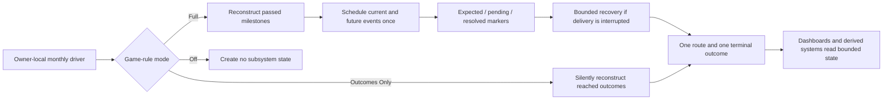

Corporate History turns major developments in computing, semiconductors, telecommunications, finance, and console manufacturing into long-running national choices. The framework contains 32 authored chains across 13 countries. Choices about standards, vertical integration, supply resilience, security control, national capacity, and market strategy establish persistent outcomes that later events, decisions, and read-only dashboards can use.

Four independent systems complement the chain catalogue: cross-tag GPU development, Israeli OEM history, legacy American OEM and storage history, and the derived American Physical Compute Stack. A separately selectable Linux ecosystem and an American real-options economic layer connect established industrial outcomes to broader policy without becoming additional scheduled chains.

## Game rules

| Rule              | Script options                      | Campaign behavior                                                                                                                                                                                                                                                                                                                                        |
| ----------------- | ----------------------------------- | -------------------------------------------------------------------------------------------------------------------------------------------------------------------------------------------------------------------------------------------------------------------------------------------------------------------------------------------------------- |
| Corporate History | `full`, `outcomes_only`, `disabled` | Full reconstructs milestones that predate the campaign, schedules current and future authored events once, and enables decisions, crises, and dashboards. Outcomes Only silently reconstructs reached flags, variables, and outcomes without story popups or crises. Disabled creates no Corporate History state while native systems remain functional. |
| Linux Ecosystem   | `full`, `outcomes_only`, `off`      | Full enables Linux events, national integrations, programs, and economic effects. Outcomes Only silently reconstructs reached adoption and support milestones. Off creates no Linux state or effects.                                                                                                                                                    |

Linux remains independent from Corporate History. All nine rule combinations are valid. Disabling Corporate History does not disable native Belt and Road content, change the Linux setting, or create Linux state.

Linux lifecycle work is bounded to its declared participant countries: Brazil, China, France, Germany, India, Poland, Russia, the United Kingdom, the United States, and Venezuela. Each participant uses its own monthly country on-action; no global country callback or registry is used.

## Scheduling and reconstruction lifecycle

Each chain runs only in its owning country. Native country on-actions host the monthly driver where one already exists; the framework adds a country-specific host only when necessary. There is no global country scan.

In Full mode, a later start records historical milestones without replaying old rewards or popups, then schedules only current and future content. Normal delivery uses one scheduling path. Expected, pending, and resolved markers let a bounded recovery path restore an interrupted due event without becoming a second scheduler. Each chain ends in one terminal route, and save/reload cannot repeat its reward.

Outcomes Only uses the same historical dates and terminal routes but applies them silently. Disabled or Off modes do not initialize owned flags, variables, ideas, or decisions.

## Chain catalogue

- **United States, 14:** Apple, Dell, E3, Google, Texas Instruments, Micron, Motorola, AIG, HP, IBM, NVIDIA, Oracle, Sun/Microsoft, and Xbox.
- **Canada, 3:** ATI/AMD, Matrox, and BlackBerry.
- **Taiwan, 3:** Foxconn, Taiwan's PC Giants, and TSMC.
- **China, 2:** Lenovo and Huawei.
- **Japan, 2:** Nintendo and Sony.
- **Europe and Eurasia, 8:** Nokia, Siemens, Ericsson, Polish Industrial Sovereignty, France Corporate Systems, Arm Holdings, Russian Computing Sovereignty, and Ukrainian Strategic Industry.

## Shared and independent systems

| System                                  | Role                                                                                                                                                                                                                                                                    |
| --------------------------------------- | ----------------------------------------------------------------------------------------------------------------------------------------------------------------------------------------------------------------------------------------------------------------------- |
| Cross-tag GPU development               | A technology chronology delivered to the country that owns each milestone. It prevents duplicate national rewards while allowing later chains to read established GPU history.                                                                                          |
| Israeli OEM history                     | An independently dispatched national history of specialized electronics, defense-civilian spillovers, foreign acquisition, and startup networks.                                                                                                                        |
| Legacy American OEM and storage history | Historical American manufacturing, defense-technology, storage, and support-model choices that contribute bounded state to later systems.                                                                                                                               |
| Physical Compute Stack                  | A derived American result calculated from established hardware, storage, semiconductor, and systems outcomes. It has no separate scheduler.                                                                                                                             |
| Linux ecosystem                         | A shared adoption, support-model, assurance, and public-policy system with national adapters. Adapters contribute bounded values and cannot write back into their source chains.                                                                                        |
| American real-options economy           | Reads productivity, fiscal conditions, energy, labor, infrastructure, microchip capacity, and established Corporate History outcomes. It derives investment readiness, innovation diffusion, industrial depth, infrastructure pressure, and four timed policy programs. |
| National dashboards                     | Read-only summaries of established chain state, terminal outcomes, and active policy programs. Dashboards do not schedule events or create authoritative state.                                                                                                         |

## State ownership and interactions

Each chain owns its prefixed flags and variables. A chain may read another chain only when that dependency is declared in the schema-v6 contract. Cross-chain writes require an explicit declared integration and remain narrowly scoped. Shared readers use established state; they do not manufacture missing outcomes.

Variables are bounded at their authoritative write points. Direct game state, such as ideas, focus completion, country existence, subject status, and collapse state, is read directly instead of duplicated into flags. Owners must exist, retain their original tag, and remain uncollapsed before Full-mode delivery. AI routes must remain affordable, including bankruptcy guards for material costs.

Linux adapters, GPU integrations, the Physical Compute Stack, economic bridges, and dashboards are one-way readers or bounded contributors. They cannot feed their derived result back into the state that produced it.

## Adding or extending a chain

1. Give the chain one original-tag owner, one monthly driver, one normal scheduler, one reconstruction effect, and one terminal marker.
2. Define dated milestones with expected, pending, and resolved delivery markers. Keep recovery idempotent and separate from normal scheduling.
3. Implement all Corporate History modes: Full delivery, silent Outcomes Only reconstruction, and inert Disabled behavior. Guard country existence and collapse.
4. Declare bounded variables, outcome ideas, allowed reads and writes, scheduler callers, dependencies, and localisation prefixes in `tools/corporate_history_contract.json` using schema version 6.
5. Add English localisation, effect previews, AI affordability guards, and attributed art or an existing generic sprite. Do not add unlicensed or generated art.
6. Add deterministic state-model and scheduler tests for normal delivery, later starts, interrupted recovery, one terminal route, save/reload safety, and every affected game-rule combination.
7. Run `python tools/validation/validate_corporate_history_contract.py --strict` without changing the command-line entry point or contract format.
